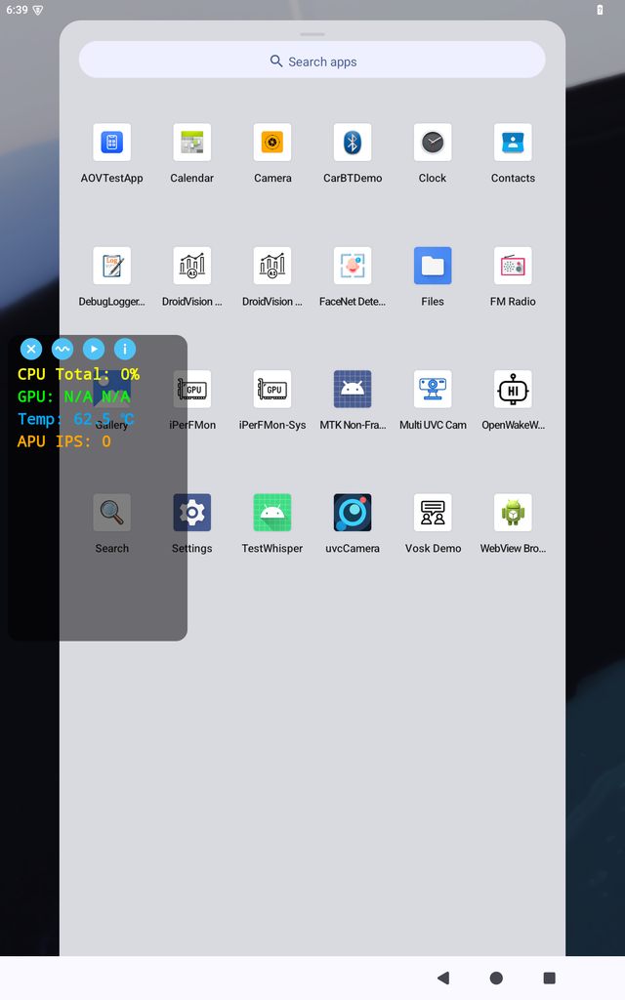
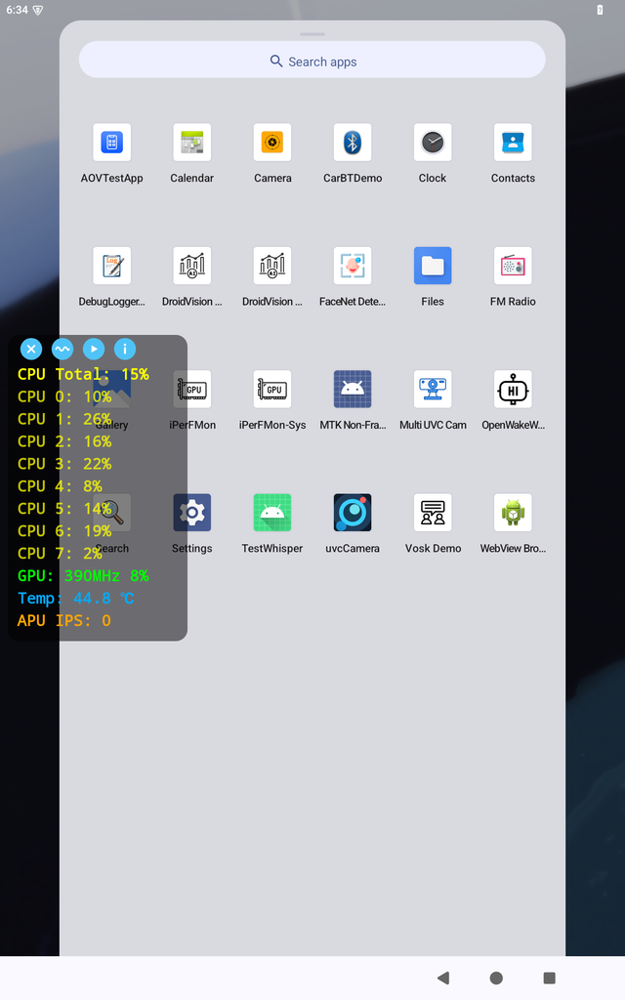
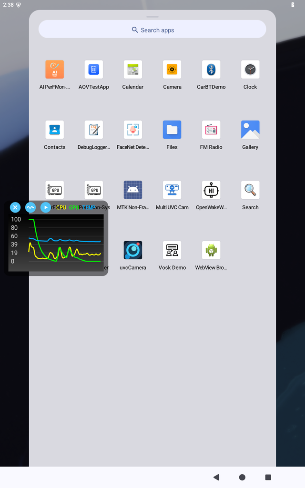
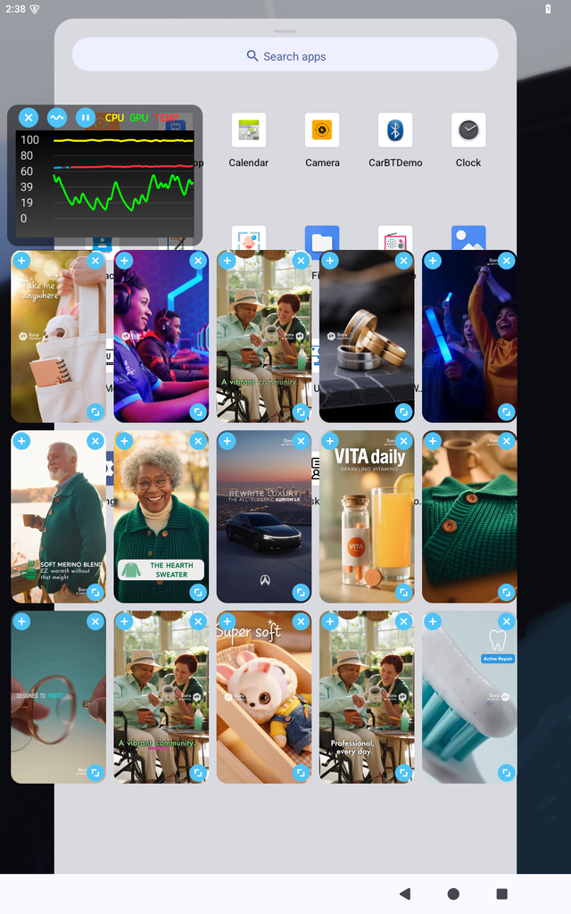
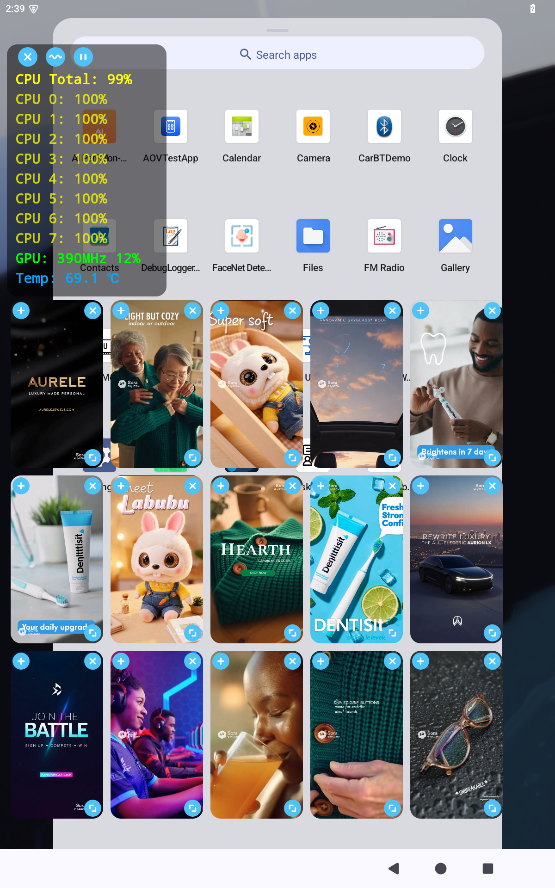

# iPerFMon — Performance Monitor Floating Overlay

A system-level hardware performance monitoring overlay for MTK-based Android devices. It runs as a persistent foreground service that draws a floating panel over all other apps, displaying real-time CPU, GPU, and temperature metrics in either text or waveform graph form. An optional multi-window video player can be toggled alongside the monitor panel.

## Features

- **Floating overlay panel** — always-on-top, draggable, rounded-corner panel powered by `WindowManager`
- **TEXT mode** — per-core CPU load, total CPU%, GPU frequency & utilization, CPU temperature; updates every 500 ms
- **GRAPH mode** — smooth 60-sample waveform curves for CPU, GPU, and temperature with dynamic Y-axis scaling
- **Multi-device GPU support** — reads from GED HAL (`/sys/kernel/ged/hal/gpu_utilization`) with automatic fallback to `/proc/gpufreq/gpufreq_var_dump` for older MTK platforms
- **Multi-device temperature support** — uses `HardwarePropertiesManager` when available; automatically falls back to `/sys/class/thermal/thermal_zone*/temp` sysfs on devices without the required system permission
- **EMA filtering** — exponential moving average (α = 0.2) applied to GPU readings to eliminate jitter
- **Orientation-aware video player** — multiple video windows; portrait layout stacks videos below the panel, landscape layout places them to the right
- **Custom icon style** — all control buttons use a consistent sky-blue circle with white icon design (`#4FC3F7`)
- **Info dialog** — tap the ⓘ button to show a fullscreen overlay with company QR code and logo; tap anywhere to dismiss
- **Two build flavors**:
  - `system` — installed as a system app (`android.uid.system`), full hardware access including `HardwarePropertiesManager` temperatures
  - `normal` — standard APK for testing without system privileges

## Screenshots

| TEXT mode (summary) | TEXT mode (per-core) | GRAPH mode |
|---|---|---|
|  |  |  |

| GRAPH + video player (portrait) | TEXT + video player (high load) | Info dialog |
|---|---|---|
|  |  |  |

## Requirements

- Android 7.0 (API 24) or higher
- MTK-based SoC (MT8367 / Genio 350 tested; other MTK Dimensity / Mali GPU devices supported)
- **`system` flavor**: must be pushed to `/system/priv-app/` and signed with the platform key; requires `adb root` + `adb shell setenforce 0` + `chmod 644 /sys/kernel/ged/hal/gpu_utilization` on first boot
- **`normal` flavor**: grant `SYSTEM_ALERT_WINDOW` overlay permission manually

### Device Setup

Run this to enable access to restricted MTK device information.

```bash
#!/bin/bash

adb root
adb shell setenforce 0
adb shell chmod 644 /sys/kernel/ged/hal/gpu_utilization
```

## Stress Testing with Multi-Window Video Player

The built-in video player is designed as a **hardware stress test tool**. Playing multiple simultaneous video windows drives up CPU decoder load, GPU rendering, and heat dissipation — all observable in real time on the monitor panel.

### How to run a stress test

1. Place one or more `.mp4` test clips under `app/src/main/assets/video/` before building.
2. Install the APK and launch the overlay.
3. Tap the **▶ (play)** button — the first video window appears automatically.
4. Tap **＋** on any video window to add another; repeat until the desired load is reached.
5. Switch to **GRAPH mode** (waveform button) to watch CPU, GPU, and temperature curves climb in real time.
6. Resize individual windows with the corner handle to adjust decoder resolution and GPU fill rate.
7. Tap **✕** on a window to remove it, or tap the **play button again** to close all windows and stop the test.

### What to observe

| Metric | Expected behaviour under load |
|--------|-------------------------------|
| CPU per-core | Decoder threads saturate one or more cores |
| GPU % & frequency | GPU scales up as more windows are rendered |
| Temperature | Rises steadily; waveform line turns red above 65 °C |

> **Tip:** Use portrait orientation to stack videos vertically for a compact multi-window view, or landscape to spread them to the right of the panel.

## Architecture

```
MainActivity
  └→ FloatingWindow (foreground Service + WindowManager overlay)
       ├→ HardwareMonitor.kt  — reads /proc/stat, /sys/kernel/ged/, /proc/gpufreq/, HardwarePropertiesManager
       │    └→ EmaFilter.kt   — exponential moving average smoothing
       ├→ WaveformView.java   — custom Canvas graph (60-sample ring buffer, Bézier curves)
       └→ FlowLayout.java     — custom ViewGroup for multi-video row wrapping
```

All UI is built programmatically — no XML layout files. `FloatingWindow` drives a 500 ms background monitoring loop via `Handler`, updates `TextView` lines (TEXT mode) or calls `WaveformView.addSample()` (GRAPH mode).

GPU frequency is read in priority order:
1. `/sys/class/devfreq/<mali-dir>/cur_freq` (newer MTK / Dimensity, Hz)
2. `/proc/gpufreq/gpufreq_var_dump` → `g_cur_opp_freq` field (older MTK, KHz)
3. `/sys/kernel/ged/hal/current_freqency` (GED HAL, Hz — note intentional MTK kernel typo)

Temperature is read in priority order:
1. `HardwarePropertiesManager.getDeviceTemperatures()` (requires `DEVICE_POWER` permission)
2. `/sys/class/thermal/thermal_zone*/temp` sysfs — battery, charger, skin, Wi-Fi zones excluded; result averaged across remaining CPU-related zones

Slow-changing metrics are throttled internally in `HardwareMonitor` to reduce I/O: GPU frequency refreshes every 1 s, temperature every 2 s.

## License

This project is licensed under the MIT License.  
Copyright © 2025 InnoComm Mobile Technology Corp (<https://www.innocomm.com/>)  
See [LICENSE](LICENSE) for details.

## Third-Party Libraries

| Library | Version | License | Notes |
|---------|---------|---------|-------|
| androidx.core:core-ktx | 1.12.0 | [Apache 2.0](https://www.apache.org/licenses/LICENSE-2.0) | Android KTX extensions; Apache 2.0 requires inclusion of license text in distributions |
| com.google.zxing:core | 3.5.3 | [Apache 2.0](https://www.apache.org/licenses/LICENSE-2.0) | QR code generation for info dialog; Apache 2.0 requires inclusion of license text in distributions |
